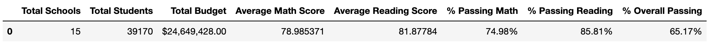
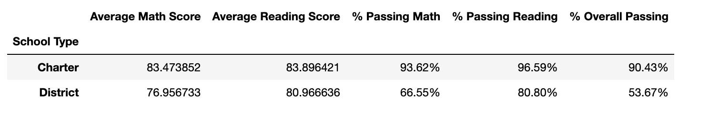

# PyCity Schools Analysis
This project was to look at various attributes of fictional "PyCity" schools against their reading and math scores to showcase any trends. The dataset contained 15 schools and 39170 students:

I looked at school type, grade, school spending, and school size to determine any trends.

All of my analysis can be found in `PyCitySchools/PyCitySchools.ipynb`.
* NOTE: `PyCitySchools_starter.ipynb` is an example notebook included in the excercise and **does NOT** contain my original work and analysis

The `Resources` directory contains the source data files.
